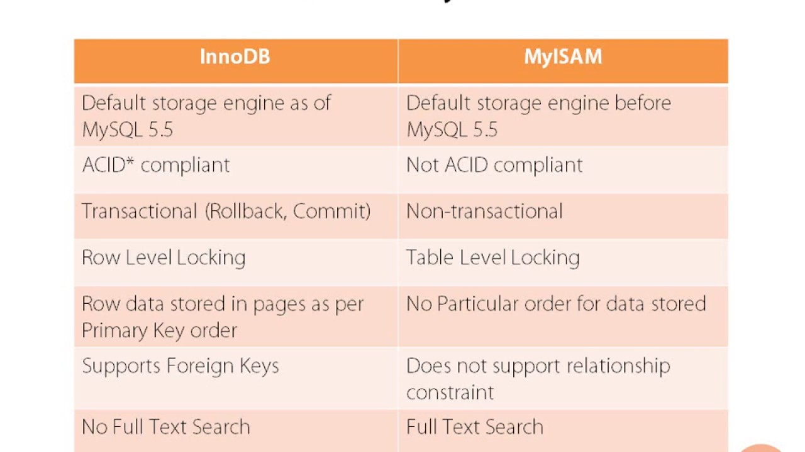

<div align="center">

# Deep Dive  
Deep Dive into Real My SQL 8.0(1)

--- 
</div>

## Contents
- [MySQL 8.0에서의 default my.cnf는 어떻게 작성되었을까?](#mysql-80에서의-default-mycfn는-어떻게-작성되었을까)
---
### MySQL 8.0에서 my.cnf(default)는 어떻게 작성되었을까? 
라즈베리파이 5 웹서버에 MySQL 8.0을 설치한 후, 기본 `my.cnf`가 어떻게 구성되어 있는지 확인해 보았습니다.

mysql의 설정 파일은 다음과 같이 이루어져있습니다.

```
/etc/mysql
├── conf.d
│   ├── mysql.cnf
│   └── mysqldump.cnf
├── debian-start/
├── debian.cnf
├── my.cnf
├── my.cnf.fallback
├── mysql.cnf
└── mysql.conf.d
    ├── mysql.cnf
    └── mysqld.cnf

```
위에 파일들 중 기본 설정이 담긴 ```my.cnf```, ```mysql.cnf```, ```mysqld.cnf```를 순서대로 확인해보겠습니다. 

먼저, my.cnf파일입니다.
```
choi@choi-desktop:~$ sudo cat /etc/mysql/my.cnf
#
# The MySQL database server configuration file.
#
# You can copy this to one of:
# - "/etc/mysql/my.cnf" to set global options,
# - "~/.my.cnf" to set user-specific options.
# 
# One can use all long options that the program supports.
# Run program with --help to get a list of available options and with
# --print-defaults to see which it would actually understand and use.
#
# For explanations see
# http://dev.mysql.com/doc/mysql/en/server-system-variables.html

#
# * IMPORTANT: Additional settings that can override those from this file!
#   The files must end with '.cnf', otherwise they'll be ignored.
#

!includedir /etc/mysql/conf.d/
!includedir /etc/mysql/mysql.conf.d/
```

위에서 확인할 수 있듯 ```/etc/mysql/my.cnf```는 실제 설정이 아니라
```/etc/mysql/conf.d/``` 와 ```/etc/mysql/mysql.conf.d/``` 디렉토리를 포함(include)하기 위한 상위 파일입니다.
실제 서버 설정은 두 디렉터리 내 .cnf 파일들, 예를 들어 mysqld.cnf 등에서 정의됩니다 

다음은 ```mysql.cnf``` 입니다. 
```
choi@choi-desktop:/etc/mysql/mysql.conf.d$ cat mysql.cnf 
#
# The MySQL database client configuration file
#
# Ref to https://dev.mysql.com/doc/refman/en/mysql-command-options.html

[mysql]
```
중요한 내용은 없어보입니다. 

마지막으로 ```mysqld.cnf```파일 입니다.

```
choi@choi-desktop:/etc/mysql/mysql.conf.d$ cat mysqld.cnf 
#
# The MySQL database server configuration file.
#
# One can use all long options that the program supports.
# Run program with --help to get a list of available options and with
# --print-defaults to see which it would actually understand and use.
#
# For explanations see
# http://dev.mysql.com/doc/mysql/en/server-system-variables.html

# Here is entries for some specific programs
# The following values assume you have at least 32M ram

[mysqld]
#
# * Basic Settings
#
user		= mysql
# pid-file	= /var/run/mysqld/mysqld.pid
# socket	= /var/run/mysqld/mysqld.sock
# port		= 3306
# datadir	= /var/lib/mysql


# If MySQL is running as a replication slave, this should be
# changed. Ref https://dev.mysql.com/doc/refman/8.0/en/server-system-variables.html#sysvar_tmpdir
# tmpdir		= /tmp
#
# Instead of skip-networking the default is now to listen only on
# localhost which is more compatible and is not less secure.
bind-address		= 127.0.0.1
mysqlx-bind-address	= 127.0.0.1
#
-----------------------------------------------------
# * Fine Tuning
#
key_buffer_size		= 16M
# max_allowed_packet	= 64M
# thread_stack		= 256K

# thread_cache_size       = -1

# This replaces the startup script and checks MyISAM tables if needed
# the first time they are touched
myisam-recover-options  = BACKUP

# max_connections        = 151

# table_open_cache       = 4000
-----------------------------------------------------
#
# * Logging and Replication
#
# Both location gets rotated by the cronjob.
#
# Log all queries
# Be aware that this log type is a performance killer.
# general_log_file        = /var/log/mysql/query.log
# general_log             = 1
#
# Error log - should be very few entries.
#
log_error = /var/log/mysql/error.log
#
# Here you can see queries with especially long duration
# slow_query_log		= 1
# slow_query_log_file	= /var/log/mysql/mysql-slow.log
# long_query_time = 2
# log-queries-not-using-indexes
#
# The following can be used as easy to replay backup logs or for replication.
# note: if you are setting up a replication slave, see README.Debian about
#       other settings you may need to change.
# server-id		= 1
# log_bin			= /var/log/mysql/mysql-bin.log
# binlog_expire_logs_seconds	= 2592000
max_binlog_size   = 100M
# binlog_do_db		= include_database_name
# binlog_ignore_db	= include_database_name
```

 ```mysqld.cnf```는 크게 세 부분으로 나누어져 있어 각각 어떤 내용이 포함 되어있는 지 확인해보겠습니다. 
 #### 1. Basic Settigs 
 Basic Settings 부분에는 MySQL 서버 데몬이 어떤 권한으로, 어디에, 어떻게 동작되는 지 정리되어있습니다.
 
제일 기본적인 user와 pid file, 접속을 위한 socket, port 번호, 데이터 베이스 저장 디렉토리가 명시되어 있습니다.
- user		= mysql
- pid-file	= /var/run/mysqld/mysqld.pid
- socket	= /var/run/mysqld/mysqld.sock
- port		= 3306
- datadir	= /var/lib/mysql

주목해야하는 부분은 다음 부분입니다. MySQL에서는 정렬, JOIN 등 임시 작업 중 생성되는 파일의 저장 디렉토리를 따로 저장해놓습니다.  
- tmpdir = /tmp

 #### 2. Fine Tuning
Fine Tuning 부분에는 서버의 성능과 안정성을 조정하기 위한 메모리, 스레드, 캐시, 복구 옵션이 명시되어 있습니다.
- key_buffer_size = 16M
- max_allowed_packet = 64M
- thread_stack = 256K
- thread_cache_size = -1
- myisam-recover-options = BACKUP
- max_connections = 151
- table_open_cache = 4000

이 부분에서는 myisam에 주목해야할 것 같습니다. 

> 5.5 version 전에는 스토리지 엔진으로 MyISAM을 채택하여 사용하였지만 트랜잭션, 동시성, 무결성, 복구 기능이 복잡해지고있는 현재에는 사용하기에 부적합합니다. 구버전 MySQL로 되어있어 호환이 필요한 상황에서만 사용되고 현재는 innoDB가 모든 부분을 충분히 지원합니다.  

 #### 3. Logging and Replication
Logging and Replication 부분에는 로그 관리와 복제(Replication) 관련 옵션이 명시되어 있습니다. 

- server-id = 1
- log_bin = /var/log/mysql/mysql-bin.log
- binlog_expire_logs_seconds = 2592000
- max_binlog_size = 100M
- binlog_do_db = include_database_name
- binlog_ignore_db = include_database_name
 
Error Log, Slow Query Log, Binary Log 등 여러 종류의 로그에 관한 설정들이 포함되어있고 복제 환경에서의 설정들이 포함되어있습니다. 아직은 ch 2이기 때문에 master/slave, replication에 관련된 부분은 해당 챕터에서 더 뜯어보겠습니다.
