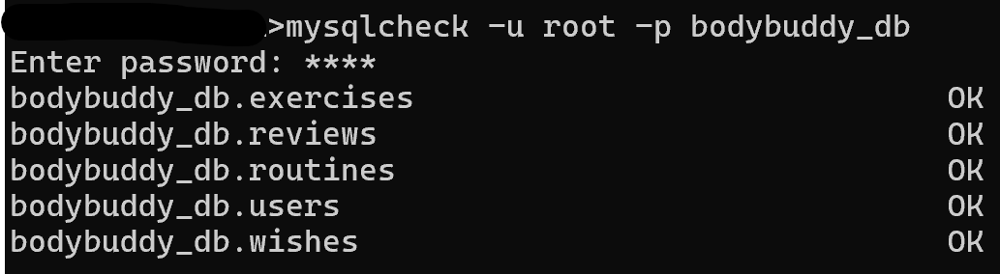

# MySQL 서버 업그레이드

### 시맨틱 버저닝(Semantic Versioning = SemVer)

소프트웨어 버전을 체계적으로 관리하기 위한 규칙 집합, 현재 소프트웨어 업계에서 널리 사용

* `MAJOR.MINOR.PATCH[-PRE_RELEASE][+BUILD]`
* ex) `MySQL 8.0.25`라면 8이 메이저 버전, 0이 마이너 버전, 25가 패치 버전
* Major : 기존 API가 변경/삭제 되었기 때문에 업데이트하면 동작하지 않을 수 있다는 의미(API 호환 x)
* Minor : 이전 버전과 호환되는 기능 추가
* Patch : 이전 버전과 호환되는 버그 수정
* ~(틸드) : 같은 마이너 버전 안에서 패치 버전은 올라가도 된다
  * ex) `~1.0.0` -> 1.0.0 이상 1.1.0 미만 버전 허용
* ^(캐럿) : 호환 가능한 가장 높은 버전까지 허용 (메이저 버전이 0이면 더 엄격)
  * ex) `^x.y.z` -> x.y.z 이상 (x+1).y.z 미만, (x,y,z는 1 이상)  
    `^0.x.y` -> 0.x.y 이상 0.(x+1).0 미만  
    `^0.0.x` -> 0.0.x만 가능  
  * TMI) 나는 연속되는 0 다음 숫자까지 고정이라고 생각하니까 편했음
* 다만 책의 예시에 나왔던 5.5 -> 5.7 -> 8.0같은 경우는 MySQL은 8 버전 이전에는 두 번째 자리까지 메이저 버전이었다고 함

### 서버 업그레이드 시 고려 사항
* 버전 간의 차이점과 사용할 수 없게 되는 기능을 고려
* 예시
  * 사용자 인증 방식이 바뀌지만 기존 방식을 사용할 수 있는지
  * 호환되지 않는 데이터 타입 또는 함수가 있는지 mysqlcheck 유틸리티로 확인 등
    * mysqlcheck 유틸리티 : MySQL 데이터베이스 테이블을 점검하고 복구하는 명령줄 도구
    
  * 인덱스 힌트 : 쿼리 실행 시 옵티마이저에게 특정 인덱스를 사용하도록 지시하는 문법
    * 기존 버전에서 사용하던 인덱스 힌트가 업그레이드 한 버전에서 괜찮은지 성능테스트를 진행

### 서버 업그레이드 방법
* In-Place Upgrade
  * MySQL 서버의 데이터 파일을 그대로 두고 업그레이드
  * 여러가지 제약 사항이 있지만 업그레이드 시간을 크게 단축 가능
  * 메이저 버전 간의 업그레이드는 순서대로 해야한다. ex) 5.5 -> 5.7 -> 8.0
    * 직전 버전의 데이터 파일과 로그 포맷만 인식하게 구현했기 때문
    * 따라서 2단계 이상 업그레이드 할 시에 Logical Upgrade가 더 나을 수 있다
    * 이전 메이저 버전이어도 GA 버전(General Availability, 정식 출시된 안정적인 버전)이 아닌 경우에는 바로 업그레이드 할 수 없다 -> 최소 GA 버전 이상을 쓰도록하자
  * 마이너 버전은 버전을 건너 뛸 수 있다
  * 방법 : MySQL 셧다운 -> MySQL 5.7 삭제 -> MySQL 8.0 설치 -> MySQL 8.0 서버(mysqld) 시작(MySQL 서버가 데이터 딕셔너리 업그레이드 실행 후, 시스템 테이블 구조를 8.0에 맞게 변환)
    * 데이터 딕셔너리(DD) : 데이터베이스 시스템이 자체적으로 관리하는 메타데이터 저장소(테이블, 뷰, 인덱스 등)
    * 서버 업그레이드 : 시스템 테이블 구조를 8.0 버전에 맞게 변환
* Logical Upgrade
  * mysqldump 도구 등을 이용해 MySQL 서버의 데이터를 SQL 문장이나 텍스트 파일로 덤프한 후, 새로 업그레이드된 버전의 MySQL 서버에서 덤프된 데이터를 적재하는 방법
  `mysql -u [username] -p [new_database_name] < [dump_file.sql]`
  * In-Place Upgrade에 비해 버전 간 제약사항이 거의 없지만 업그레이드 시간이 매우 많이 소요될 수 있음
  * 버전 차이에 따른 덤프파일 디버깅은 필요하다
  * 방법 : 덤프파일 추출 -> MySQL 셧다운 -> MySQL 5.7 삭제 -> MySQL 8.0 설치 -> MySQL 8.0 서버(mysqld) 시작 -> 덤프파일 적재(필요시 호환성 문제 수정)
