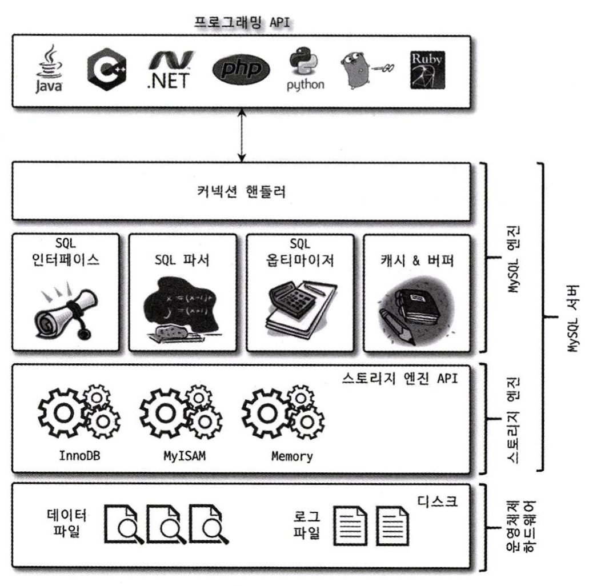
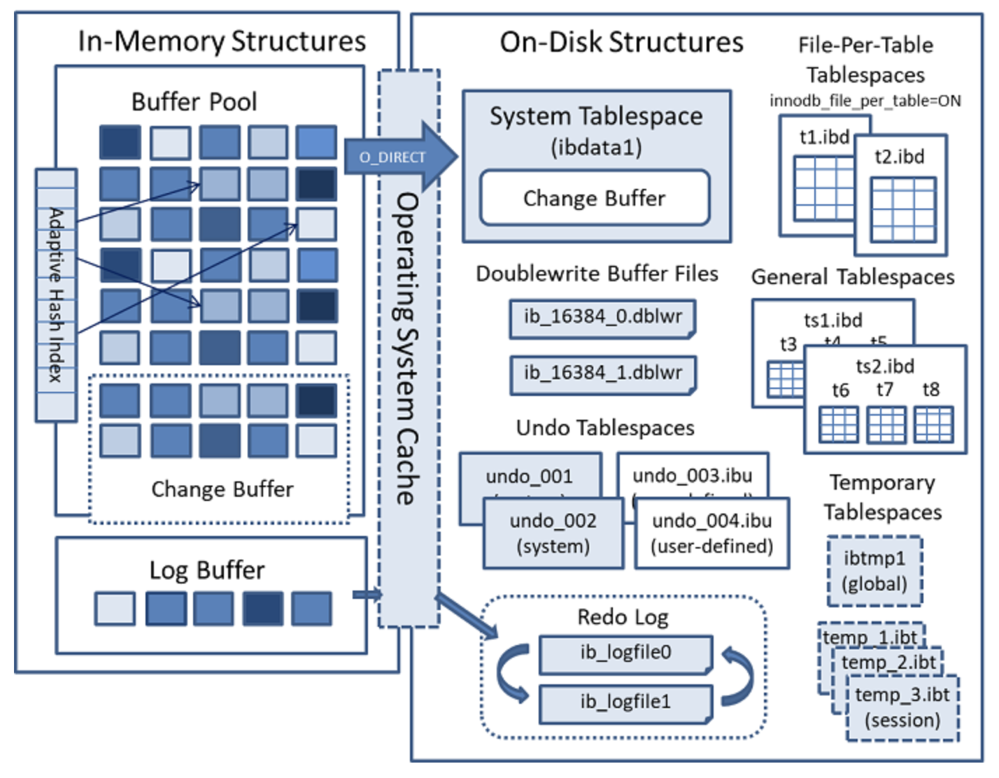

# ✅ MySQL 전체 워크플로우
---
 

## ✅ MySQL 엔진 내부 처리 흐름
---
#### 0. Connection Handler
* 클라이언트가 TCP Connection을 열면, MySQL 서버는 해당 Connection마다 Connection Handler를 생성
* Spring Boot의 Connection Pool은 미리 생성된 JDBC Connection 객체들을 가지고 있기 때문에 이미 만들어진 Connection Handler를 사용
* 클라이언트로부터 패킷 수신
* 세션 상태 관리 (사용자 정보, 트랜잭션 상태)

#### 1. 네트워크 버퍼(Net Buffer)
* MySQL 서버 내부에 존재하는 메모리 버퍼
* 클라이언트가 보낸 쿼리 패킷을 네트워크 계층에서 읽어와 임시 저장

#### 2. SQL 인터페이스  
* 클라이언트가 전송한 SQL 문자열을 수신 ex) `SELECT * FROM users WHERE id=1` 
* 이게 어떤 쿼리인지를 판별 후에 쿼리 파서에 전달 
   * `COM_QUERY` :  SELECT/INSERT/UPDATE/DELETE
   * `COM_PREPARE`, `COM_EXECUTE` : 준비된 문장 처리
   * `COM_STMT_CLOSE`, `COM_PING`, `COM_QUIT` 등 : 기타 명령
* 명령어 유형에 따라 적절한 처리 모듈로 분기

#### 3. 쿼리 파서  
* SQL 문장을 토큰화 및 파싱하여 AST(Abstract Syntax Tree) 생성
* SQL 구문 오류가 있으면 여기서 에러 반환

#### 4. 전처리기  
* 사용자 권한 검사
   * 시스템 테이블스페이스(mysql.ibd)에서 조회
* 테이블 존재 여부 확인  
   * 테이블 캐시(Table Definition Cache)에서 검색
   * 없으면 시스템 테이블스페이스 내부의 데이터 딕셔너리 내부의 테이블 디스크립터에서 조회

#### 5. SQL 옵티마이저  
* 인덱스 통계, 인덱스 사용 여부, 조인 순서 및 인덱스 힌팅 등을 기반으로 비용 기반 최적 실행 계획 수립

#### 6. 쿼리 실행기  
* 옵티마이저가 생성한 실행 계획을 바탕으로 실제 쿼리 수행
* 핸들러 API를 통해 스토리지 엔진에 요청을 보냄
* 핸들러 API는 단일 레코드 단위로 설계되었기 때문에 1건의 레코드 단위로 처리
   * 예: `read_row()`, `write_row()`

## ✅ 메서드 별 스토리지 엔진 내부 처리 흐름
---
 

### ✅ GET (SELECT)
---
#### 7. InnoDB Buffer Pool  
* 조회 대상 페이지가 있으면 메모리에서 반환  
* 없으면 디스크(.ibd 파일)에서 읽어와 Buffer Pool에 적재 후 반환
* 해당 레코드가 Read View에 부합하는지 확인
   * 적합하지 않다면 Undo 로그를 참조하여 과거 버전으로 복원(MVCC)

#### 8. Result Buffer
* `ORDER BY`, `GROUP BY`, `LIMIT` 등의 후처리 작업 수행
* 수행 결과는 Result Buffer에 저장
* Result Buffer의 패킷 단위 블록이 생성 완료되었을 때 전송

#### 9. Net Buffer
* 클라이언트에게 전송할 최종 데이터가 직렬화되어 저장되는 전송 준비 버퍼
* Result Buffer의 결과를 Net Buffer로 복사
* Net Buffer가 가득찼을 때(flush), SELECT 처리가 끝나서 flush가 강제 호출 될 때 OS에 전송

#### 10. TCP 패킷으로 변환 → 클라이언트에 응답

### ✅ POST (INSERT)
---

#### 7. InnoDB Buffer Pool 적재
* InnoDB는 클러스터링 인덱스 순서에 따라 레코드를 삽입할 위치를 결정
* 해당 페이지가 Buffer Pool에 없으면 디스크에서 로딩
* 레코드를 삽입하고, 해당 페이지는 Dirty Page로 마킹됨

#### 8. Undo 로그 기록
* Rollback 대비 Undo 로그를 생성

#### 9. Redo 로그 버퍼 기록
* 삽입된 레코드의 내용은 Redo 로그 버퍼에 우선 저장

#### 10. 트랜잭션이 Commit 되면
* Redo 로그 버퍼 → 디스크(ib_logfile0 등)로 플러시
* 트랜잭션 메타데이터 기록
* Undo 로그 제거 가능 상태로 전환
* 클라이언트에 응답 반환

#### 11. Checkpoint 발생
* Dirty Page들이 실제로 디스크에 기록
* Doublewrite Buffer에 먼저 기록하고 그 이후 실제 테이블스페이스(.ibd)에 기록
   * Partial Page Write 방지 목적

### ✅ PUT (UPDATE)
---

#### 7. InnoDB Buffer Pool 적재
* 수정할 레코드가 포함된 페이지를 Buffer Pool에서 조회 (없으면 디스크에서 로딩)
* 해당 페이지를 수정하고 Dirty Page로 마킹됨

#### 8. Undo 로그 기록
* 변경 전 레코드 전체를 Undo 로그에 저장
* Undo 로그는 시스템 테이블스페이스(ibdata1) 또는 Undo 테이블스페이스에 저장됨

#### 9. Redo 로그 버퍼 기록
* 변경된 레코드 내용을 Redo 로그 버퍼에 저장

#### 10. 트랜잭션이 Commit 되면
* Redo 로그 버퍼 → 디스크(ib_logfile0, ib_logfile1)로 플러시
* 트랜잭션 메타데이터 기록
* Undo 로그 제거 가능 상태로 전환
* 클라이언트에 응답 반환

#### 11. Checkpoint 발생
* Dirty Page들이 실제로 디스크에 기록됨
* Doublewrite Buffer에 먼저 기록한 뒤, 테이블스페이스(.ibd)에 반영
   * Partial Page Write 방지 목적

### ✅ DELETE
---

#### 7. InnoDB Buffer Pool 적재
* 삭제 대상 레코드가 포함된 페이지를 Buffer Pool에서 조회 (없으면 디스크에서 로딩)
* 해당 레코드는 "삭제됨" 플래그만 마킹되어 논리적 삭제 처리
* 해당 페이지는 Dirty Page로 마킹됨

#### 8. Undo 로그 기록
* 삭제되기 전 전체 레코드를 Undo 로그에 저장

#### 9. Redo 로그 버퍼 기록
* 삭제된 레코드의 위치 및 인덱스 키 제거 정보 등을 Redo 로그 버퍼에 기록

#### 10. 트랜잭션이 Commit 되면
* Redo 로그 버퍼 → 디스크(ib_logfile0, ib_logfile1)로 플러시
* 트랜잭션 메타데이터 기록
* Undo 로그 제거 가능 상태로 전환
* 클라이언트에 응답 반환

#### 11. Checkpoint 발생
* Dirty Page들이 실제로 디스크에 기록됨
* Doublewrite Buffer에 먼저 기록한 뒤, 테이블스페이스(.ibd)에 반영

#### 12. Purge Thread에 의한 물리적 삭제
* 삭제된 레코드는 실제로는 페이지 내에 남아 있음
* 나중에 Purge Thread가 Undo 로그를 참조해 물리적으로 정리