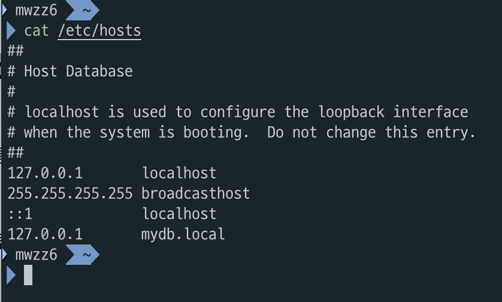
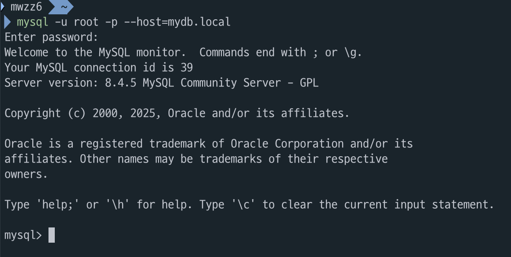
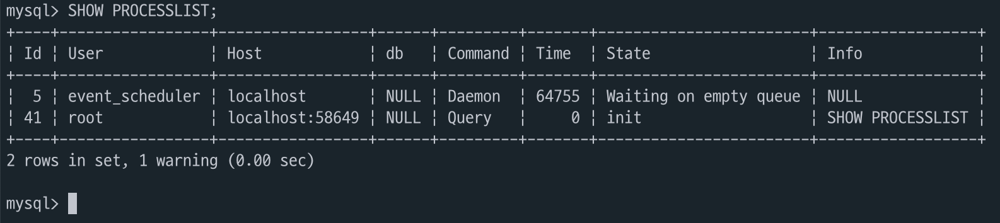

# MySQL 서버 연결

> 💡 **`mysql` 명령어 이후 옵션들을 지정해서 연결 가능**

## 대표적인 옵션들

### -u [user-name]

> 💡 **연결할 사용자 이름을 지정하는 옵션으로 생략 시 터미널 사용자 이름으로 연결 시도**  
> **비밀번호가 설정되어 있어서 연결은 안 됐음**  

> **ex)**  
> `mysql -u root`  
> `mysql -uroot`  
> `mysql` → `mysql -u mwzz6`

### -p[password]

> 💡 **뒤에 비밀번호 생략 시 명령어 입력 이후 비밀번호를 입력하게 되고 비밀번호를 명시적으로 쓸 경우 `-p` 이후 띄어쓰기 없이 붙여서 써야 함**  
> **터미널에 비밀번호가 남기 때문에 비밀번호는 생략하는 것을 추천**  

> **ex)**  
> `mysql -u root -p`  
> `mysql -u root -p1234`

### --socket=[소켓 파일 경로]

> 💡 **소켓 파일을 통해 연결한다는 옵션으로 소켓 파일 경로를 다룰 일이 없다면 생략해도 무방**  
> **기본 소켓 파일 경로는 `/tmp/mysql.sock`**  

> **ex)**  
> `mysql -u root -p --socket=/tmp/mysql.sock` = `mysql -u root -p`

### --host=[IP 주소 or 도메인]

> 💡 **MySQL 서버의 IP 주소나 도메인을 명시하는 옵션**  
> **host 옵션이 `localhost`(기본값)면 소켓 연결, 나머지는 TCP/IP 연결**  

> **ex) (`SHOW PROCESSLIST;` 명령어로 확인 가능)**  
> - `mysql -u root` → Socket  
> - `mysql -u root -p --socket=/tmp/mysql.sock` → Socket  
> - `mysql -u root -p --host=localhost` → Socket  
> - `mysql -u root -p --host=127.0.0.1` → TCP/IP  
> - `mysql -u root -p --host=1.2.3.4` → TCP/IP  
> - `mysql -u root -p --host=127.0.0.1 --socket=/tmp/mysql.sock` → TCP/IP

---

# 탐구 1 - host 옵션

> 💡 **host 옵션에 대해 찾아보던 중 IP 주소가 아닌 도메인을 명시할 수 있다는 내용을 봤다.  
> ChatGPT에 따르면 인프라 구성 시 DB에도 도메인을 부여해서 IP 주소 변경이나 로드밸런싱에 활용할 수 있다고 했다.  
> 외부에 띄워놓은 DB가 없어서 로컬 환경에서 DNS 캐시로 사용되는 hosts 파일을 통해 테스트해봤다.**

1. **hosts 파일에 127.0.0.1에 mydb.local 매핑**

    

2. **성공 (연결에 시간 좀 걸림)**

    

3. **TCP/IP로 연결됨**

    

---

# 탐구 2 - 소켓 연결 vs TCP/IP 연결

> 💡 **MySQL 서버와의 연결은 소켓을 활용한 연결과 TCP/IP를 활용한 연결 두 가지로 구분할 수 있다.  
> 연결 방법은 앞서 있던 `--host` 옵션으로 설정할 수 있으며 `localhost`는 소켓 연결,  
> IP 주소는 TCP/IP 연결, localhost를 제외한 문자열은 DNS를 통해 IP 주소 해석 후 TCP/IP 연결을 진행한다.  
> 이런 연결 로직은 MySQL이 `localhost`를 특별한 이름으로 취급해서 가능한 구조로  
> `localhost`를 제외하면 전부 TCP/IP 연결이라고 보면 된다.**

> **OS별 소켓 통신은 Windows의 경우 Named Pipe, Shared Memory, UNIX/Linux의 경우 Unix Domain Socket을 활용하며  
> 전부 프로세스 간 통신(IPC)을 통해 네트워크 스택을 거치지 않으므로 TCP/IP 연결보다 최적화되어있다. (원격 접속은 불가능)**

> **`--host=127.0.0.1`을 사용하는 경우 같은 컴퓨터지만 TCP/IP 연결을 하게 된다. (127.0.0.1 = 루프백 주소)  
> 이는 로컬 접속이지만 원격 접속과 동일한 방식이므로 속도가 느리고 컴퓨팅 자원을 더 사용한다는 단점이 있다.  
> 대신 배포 환경과 비슷한 테스트를 할 수 있다는 장점이 있다.  
> TCP를 통한 통신 자체는 NIC를 거치지 않고 OS 커널의 loopback 인터페이스를 통해 처리된다.**

---

# Ref

- **Real MySQL 8.0** - p.29
- [MySQL 8.0 공식 문서 - Connecting to the Server](https://dev.mysql.com/doc/refman/8.0/en/connecting.html)
- [What is Loopback Interface - 블로그](https://mamu2830.blogspot.com/2022/10/what-is-loopback-interface.html)
