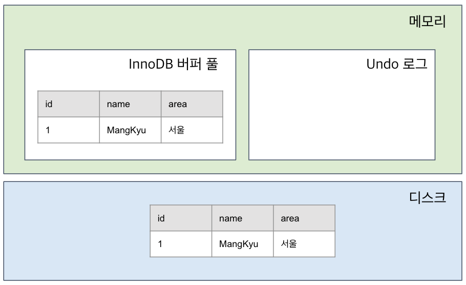
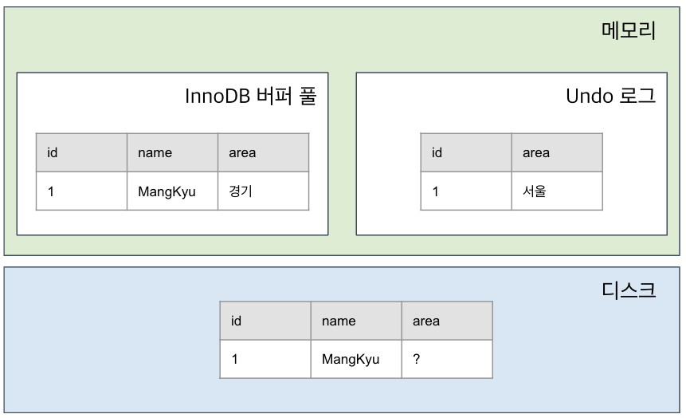

# **MVCC**

> 💡  
> **MVCC는 Multi Version Concurrency Control의 약자로 다중 버전 동시성 제어라는 뜻이다.**  
> **용어 그대로 DB의 동시성 제어를 데이터의 다양한 버전(스냅샷)을 통해 관리하는 기법이다.**  
> **일반적으로 레코드 레벨의 트랜잭션을 지원하는 DBMS가 제공하는 기능이며, MVCC의 가장 큰 목적은 잠금(락)을 사용하지 않는 일관된 읽기를 제공하는 데 있다.**  
> **→ 락을 사용하지 않아서 빠르며 일반적으로 읽기 요청이 쓰기 요청보다 많아서 효율적**  
> **MySQL에서는 Undo log를 활용하여 MVCC를 구현한다.(InnoDB)**

---

**다음은 INSERT 쿼리를 보낸 상태로 InnoDB 버퍼 풀, 언두 로그, 데이터 파일의 상태는 아래와 같이 될 것이다.**  
_(스토리지 엔진으로 InnoDB, 트랜잭션 격리수준 READ COMMITED 예시)_

---

**여기서 지역을 서울에서 경기로 바꾸는 UPDATE 쿼리를 보내면 InnoDB 버퍼 풀, 언두 로그, 데이터 파일의 상태는 아래와 같이 된다.**

---

- **COMMIT 여부와 관계없이 UPDATE 쿼리의 결과로 InnoDB 버퍼 풀은 갱신된 값이 저장되지만 언두 로그에는 UPDATE 이전의 값이 저장되게 된다.**
- **데이터 파일의 경우 체크포인트나 InnoDB의 Write 스레드에 의해 새로운 값으로 업데이트돼 있을 수도 있고 아닐 수도 있다.**
- **현재 상태에서 다른 사용자가 SELECT 쿼리로 작업 중인 레코드를 조회하면 트랜잭션 격리 수준에 따라 업데이트 이전의 값이 조회될 수도 업데이트 이후의 값이 조회될 수도 있다.**

---

### 격리 수준에 따른 조회 결과

- **READ UNCOMMITED** 격리 수준에서는 InnoDB 버퍼 풀이 현재 가지고 있는 **업데이트된 데이터를 읽어서 반환한다.**
- **READ UNCOMMITED 이상의 격리 수준에서는 변경되기 이전인 언두 로그의 데이터를 반환한다.**
