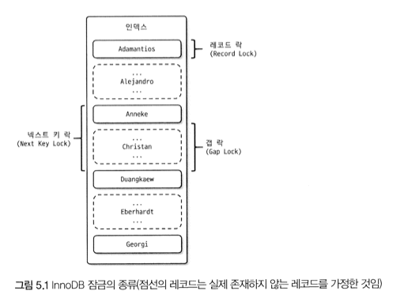

# 2025-05-14 Deep Dive - Lock

---

## **InnoDB 스토리지 엔진 레벨 잠금**

> 💡 **MySQL 엔진 레벨 잠금과는 별개로 레코드 기반 잠금 방식을 탑재하며  
> MyISAM 스토리지 엔진보다 훨씬 뛰어난 동시성 처리 제공**

---

### **레코드 락 (Record Lock, Record Only Lock)**

> 💡 **레코드 락은 레코드 자체에만 거는 잠금 (INSERT, UPDATE, DELETE)**
>
> **InnoDB 스토리지 엔진 사용 시, 데이터 변경 쿼리로 인한 MySQL 엔진 레벨 잠금인 테이블 락이 설정되지 않음**  
> (DML 쿼리에서는 테이블 락이 무시되고 DDL 쿼리의 경우에만 테이블 락)
>
> **다른 DBMS의 레코드 락과 동일한 역할을 하지만 InnoDB의 레코드 락은  
> 레코드 자체가 아니라 인덱스의 레코드를 잠금 (변경을 위해 검색한 모든 인덱스의 레코드에 락이 걸림)**
>
> **인덱스가 하나도 없는 테이블이면 내부적으로 자동 생성된 클러스터드 인덱스를 이용해 잠금**
>
> **PK 또는 유니크 인덱스에 의한 변경 작업은 레코드 락을 사용하지만,  
> 보조 인덱스에 의한 변경 작업은 갭 락 또는 넥스트 키 락을 사용**

---

### **갭 락 (Gap Lock)**

> 💡 **갭 락은 레코드와 바로 인접한 레코드 사이의 간격만을 잠금**
>
> **레코드와 레코드 사이의 간격에 새로운 레코드가 INSERT되는 것을 제어하는 역할**
>
> **갭 락 자체보다는 넥스트 키 락의 일부로 자주 사용**

---

### **넥스트 키 락 (Next Key Lock)**

> 💡 **넥스트 키 락은 레코드 락과 갭 락을 합쳐 놓은 형태의 잠금**
>
> **SQL 표준에서 REPEATABLE READ 격리 수준에서 발생할 수 있는 PHANTOM READ 현상이  
> 넥스트 키 락 덕분에 발생하지 않음**
>
> **STATEMENT 포맷의 바이너리 로그를 사용하는 MySQL 서버에서는  
> REPEATABLE READ 격리 수준을 사용해야 함 (기본이 REPEATABLE READ)**
>
> **바이너리 로그에 기록되는 쿼리가 레플리카 서버에서 실행될 때,  
> 소스 서버에서 만들어 낸 결과와 동일한 결과를 만들어내도록 보장하는 것이 주목적**
>
> **데드락이 발생하는 일이 잦아서, 가능하다면 바이너리 로그 포맷을  
> ROW 형태로 바꿔서 넥스트 키 락이나 갭 락을 줄이는 것이 좋음 (기본이 ROW 포맷)**

---

### **자동 증가 락 (Auto Increment Lock)**

> 💡 **`innodb_autoinc_lock_mode` 시스템 변수의 값에 따라 다른 자동 증가 락이 적용됨**
>
> - `innodb_autoinc_lock_mode = 0` → INSERT, REPLACE 쿼리처럼 새로운 레코드를 저장하는 쿼리에서 **테이블 수준의 잠금 사용**
> - `innodb_autoinc_lock_mode = 1` → INSERT 되는 레코드 수를 **예측할 수 있으면 자동 증가 락 없이 래치(mutex)만 사용**
> - `innodb_autoinc_lock_mode = 2` → **자동 증가 락 없이 래치만 사용 (기본값)**

---

## 📚 Ref

- Real MySQL 8.0 p.166 ~ 183
- [YouTube 강의](https://www.youtube.com/watch?v=EBBS_giQ4AM)
- [MySQL 공식 문서 – InnoDB Locking](https://dev.mysql.com/doc/refman/8.4/en/innodb-locking.html)
- [MySQL 공식 문서 – Next-Key Locking](https://dev.mysql.com/doc/refman/8.4/en/innodb-next-key-locking.html)
