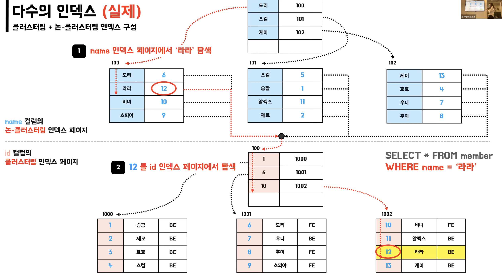

# 2025-05-21 Deep Dive - Clustered Index & Non-Clustered Index

## 인덱스(Index)

- 마치 책에서 정보를 빠르게 찾기 위해 책의 맨 끝에 있는 찾아보기를 이용하듯이 DB에서 레코드를 빠르게 찾기 위해 사용하는 자료구조

- 인덱스 덕분에 원하는 레코드를 찾기 위해 모든 레코드를 하나하나 찾아보지 않아도 됨(인덱스가 적용된 컬럼에 대해 풀 테이블 스캔 X, 항상 그런건 아님)

- 인덱스는 추가적인 저장공간(약 10%)과 쓰기 작업의 성능을 희생(인덱스 갱신)하고 읽기 작업의 성능을 높이기 위해 사용

## B-Tree(Balanced-Tree)

- 트리 자료구조 중 하나로 파일 시스템 친화적인 자료구조라서 인덱스에서 대표적으로 활용됨
- B+-Tree, B\*-Tree 등 자매 자료구조들도 있음
- B-Tree는 최상위의 루트 노드(Root Node)와 최하위의 리프 노드(Leaf Node), 중간에 브랜치 노드(Branch Node)가 있으며 데이터를 정렬된 상태로 저장하고 다진 트리면서 균형 트리임
- DBMS에서는 데이터를 페이지(Page) 단위로 관리하며 B-Tree에서도 페이지 단위로 관리

### B-Tree에서 14 찾기

## 클러스터링 인덱스(Clustered Index)

- 리프 페이지에 실제 데이터를 저장하는 인덱스로 테이블의 PK에 대해서만 적용되는 인덱스(1 테이블 1 클러스터링 인덱스)
- 우선 순위는 PK > UNIQUE NOT NULL > 내부 컬럼 추가
- PK에 의해 레코드의 물리적 저장 위치가 결정(실제 데이터 자체가 정렬)
- InnoDB 스토리지 엔진에서만 지원

## 논 클러스터링 인덱스(Non-Clustered Index)

- 리프 페이지에 PK를 저장하는 인덱스로 보조 인덱스, 세컨더리 인덱스라고 불리기도 함
- UNIQUIE, INDEX 직접 추가로 생성 가능

## 이메일을 PK로 설정해도 되나?

- 논 클러스터링 인덱스는 논 클러스터링 인덱스 페이지 스캔, 클러스터링 인덱스 페이지 스캔 2번이 발생해서 PK로 설정하지 않으면 읽기 성능에 불리할 수 있음
- 이메일은 AUTO-INCREMENT 보다 일반적으로 훨씬 긴 문자열이라서 다른 논 클러스터링 인덱스의 리프 페이지에 이 긴 문자열이 들어가게 되며 이는 인덱스 비대 유발, 페이지 분할 촉진
- 실제 물리적 저장 위치를 예상할 수 없어서 랜덤I/O 증가(GPT 피셜)
